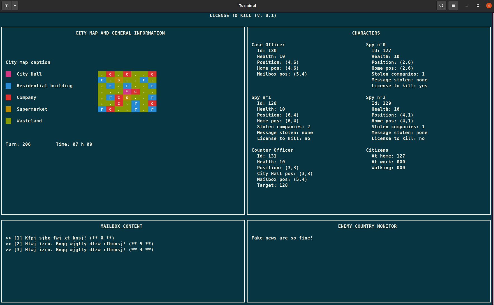

# Resources for the "License to kill" project

[Link to the project](https://foad.ensicaen.fr/pluginfile.php/39815/mod_label/intro/projet-spies.pdf?time=1665726665760)

## Compilation and Execution

Commands to compile the project :

```bash
$ make
```

or :

```bash
$ make all
```

Commands to run the simulation, where args is the time in seconds between each turn (ex, 0.1) :

```bash
$ ./bin/spy_simulation **args**
```

Commands to clean and distclean :

```bash
$ make clean
```

```bash
$ make distclean
```

Commands to compile and executes the unit tests :

```bash
$ make tests
```

Commands to compiles a specific non-unit tests :
Test for cameras :

```bash
$ make tests
$ ./bin/tests/cameras.test.out
```

## Spy Simulation program

The **spy_simulation.out** is the laucnher program, it is the program which execute and run every other precess which are listed underneath.
This *process* permits to link all the process between each other, it receive signals and transmits signals to pursue the simulation and order the process to execute their turn. It is the the timer that notify the simulation that it is time to persue the turn.

## Timer program

The **timer.out** is the program which synchronize the simulation. It needs to be executed from an other process in order to transmit the PID of the process which needs to be notified by -SIGALARM and the timer elapsed between each turn.

## Citizen Manager program

The **citizen_mamanger.out** creates as much threads as there are Citizens. The threads manage the turn of their citizen when the main program wakes them up and go back to standby mode when they are done.

## Counter Intelligence Officer program

### Counter Intelligence Officer

The **counter_intelligence_officer.out** creates the process which manages all the actions of the counter intelligence officer, from turn starts to fight signals.

### Cameras

The ***cameras*** which are create by the main program of the *Counter Officer*. The ***cameras*** checks if their is any suspicious activities made by the characters and inform the *Counter Officer* if someone is suspicious by transmiting his ID.

## Enemy Spy Network Program

The ***enemy_spy_network.ou*** creates threads which represent spies in the simulation. The threads are managing spies during all of a day. 

**enemy_spy_network.out** is the program that handles the spies and the case officer by creating their threads.

### Case officer

The case officer role is to check if there are any new messages in the mailbow and to send them to the enemy country via a message queue.

## Enemy Country

**enemy_country.out** handles the enemy country. It receives messages via a message queue from the case officer and write the non-fakes one in a file called *messages_received.txt*

## Monitor program

The *ncurses* TUI (*Terminal User Interface*) will give better results using 
The "Meslo LG L for Powerline" font that should already be installed on your
system. The font can also be downloaded at [https://github.com/powerline/fonts](https://github.com/powerline/fonts).

Here is what you should see by running "`bin/monitor`" from the root of your 
project, once you will have implemented the shared memory ("`memory_t`" 
structure).



## How to enable the logs to see what is happening turn by turn

- Enable the print : go to the ***include/common/logger.h*** file and put **1** instead of **0** to the LOG macros.
- Advice : use the ```>> test.test``` to print the log in a different file.
- Or : disable the monitor and print the log in the terminal, do as followed :
  
  - go to the ***src/main/spy_simulation/handle_simulation.c*** file ;
  - comments the lines :

```c
pid_t monitorPid = createMonitor();
[...]
waitpid( monitorPid, NULL, 0 );
```

- Then use these commands :

```sh
make distclean
make
./bin/spy_simulation 0.1
```

## Others resources

- An interesting C language guide: [Beej homepage](https://beej.us/guide/bgc/html/split/index.html)
- Coding style: see [here](https://projectacrn.github.io/latest/developer-guides/c_coding_guidelines.html#c-ty-08-the-struct-field-type-shall-be-consistent)
- Memory queue functions for MacOSX came from [Stanislav Pankevich](https://github.com/stanislaw/posix-macos-addons)'s repositery.
